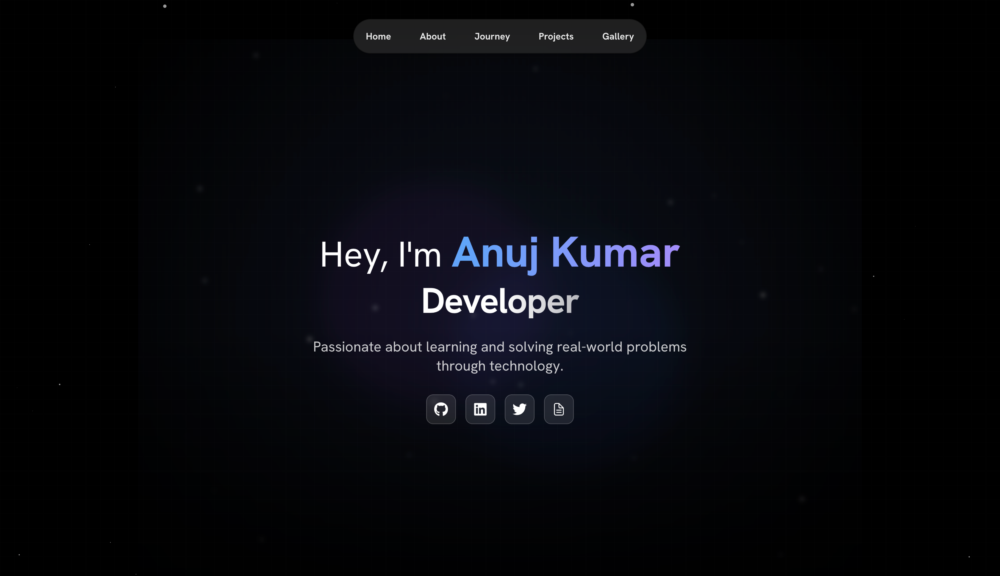
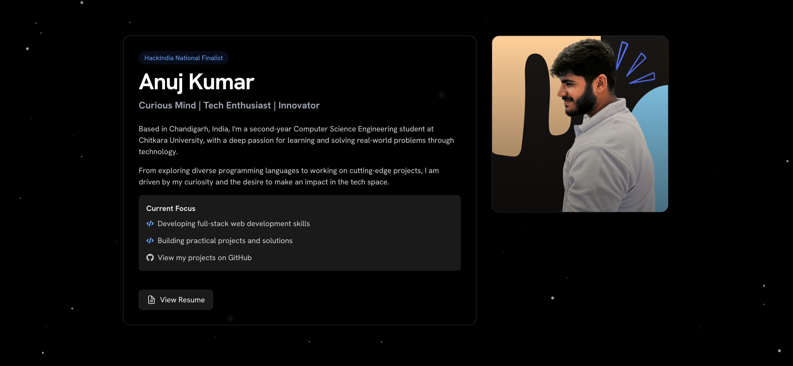
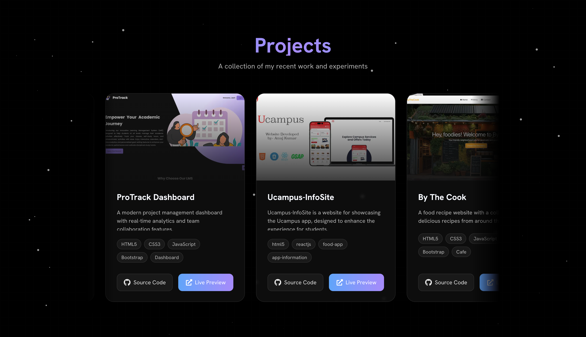
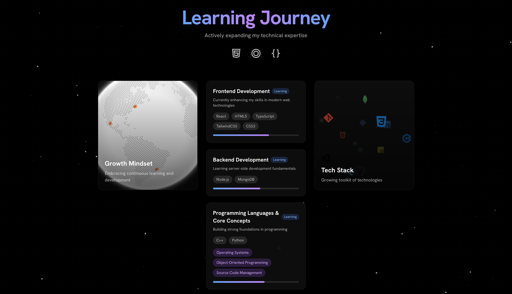
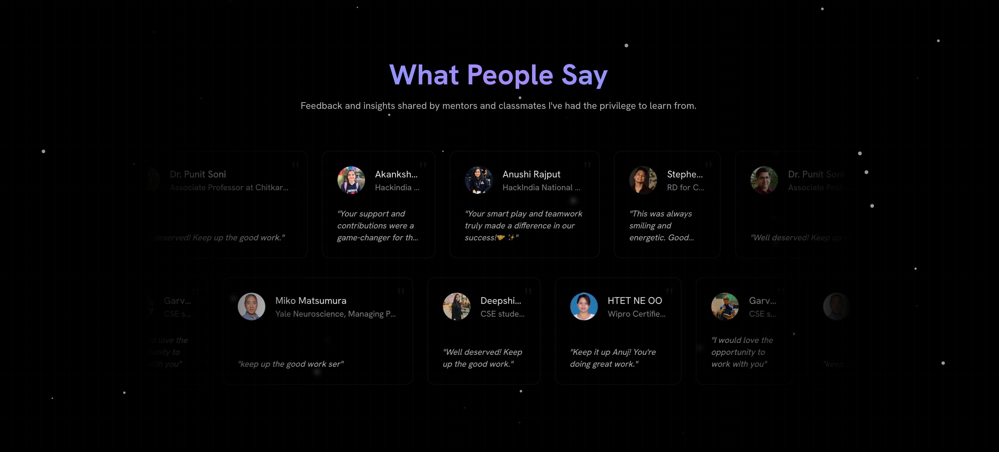

  <h1>Anuj Kumar Portfolio</h1>

  
<strong>Welcome to my portfolio repository!</strong> This project is my personal website, where I showcase my skills, projects, and professional journey through an interactive and visually engaging interface. Feel free to explore, and don't hesitate to star the repo if you like it!

  

    
  

<h2>Demo Link</h2>
  
<a href="https://siwach.vercel.app">Visit my portfolio</a>

  

<h2>🌟 Features at a Glance</h2>
<ul>
  <li><strong>Dynamic Home Page</strong> - A unique, welcoming landing experience.</li>
  <li><strong>Interactive About Section</strong> - Get to know me and my story in tech.</li>
  <li><strong>Projects Showcase</strong> - A dedicated space highlighting my best work.</li>
  <li><strong>Skills Visualized</strong> - Clear and organized display of my skills.</li>
  <li><strong>Testimonials</strong> - Feedback from mentors and colleagues.</li>
  <li><strong>Image Gallery</strong> - Photos from my journey and milestones.</li>
  <li><strong>Fluid Animations</strong> - Smooth transitions and animations and Framer Motion.</li>
</ul>

<h2>📋 Table of Contents</h2>
<ol>
  <li><a href="#-tech-stack">Tech Stack</a></li>
  <li><a href="#-screenshots">Screenshots</a></li>
  <li><a href="#-folder-structure">Folder Structure</a></li>
  <li><a href="#-setup--installation">Setup & Installation</a></li>
  <li><a href="#-detailed-documentation">Detailed Documentation</a></li>
  <li><a href="#️-contributing">Contributing</a></li>
  <li><a href="#-faqs">FAQs</a></li>
  <li><a href="#-show-your-support">Show Your Support</a></li>
</ol>

<h2>🛠️ Tech Stack</h2>
<table>
  <tr>
    <th>Technology</th>
    <th>Purpose</th>
  </tr>
  <tr>
    <td><strong>Next.js</strong></td>
    <td>Framework for server-rendered React</td>
  </tr>
  <tr>
    <td><strong>Tailwind CSS</strong></td>
    <td>Responsive, utility-first styling</td>
  </tr>
  <tr>
    <td><strong>TypeScript</strong></td>
    <td>Type safety and enhanced readability</td>
  </tr>
  <tr>
    <td><strong>GSAP</strong></td>
    <td>Advanced animations and effects</td>
  </tr>
  <tr>
    <td><strong>Framer Motion</strong></td>
    <td>Smooth transitions between elements</td>
  </tr>
</table>

<h2>🖼️ Screenshots</h2>
<table>
  <tr>
    <th>Section</th>
    <th>Image</th>
  </tr>
  <tr>
    <td><strong>Home Page</strong></td>
    <td></td>
  </tr>
  <tr>
    <td><strong>About</strong></td>
    <td></td>
  </tr>
  <tr>
    <td><strong>Projects</strong></td>
    <td></td>
  </tr>
  <tr>
    <td><strong>Journey</strong></td>
    <td></td>
  </tr>
  <tr>
    <td><strong>Gallery</strong></td>
    <td></td>
  </tr>
  <tr>
    <td><strong>Testimonials</strong></td>
    <td></td>
  </tr>
</table>

<h2>📁 Folder Structure</h2>

This project follows a clear, organized structure for maintainability and ease of navigation:

<pre>
.
├── .next                 # Next.js build files
├── app                   # Main app files
│   ├── favicon.ico       # Site icon
│   ├── globals.css       # Global styles
│   ├── layout.tsx        # Main layout file
│   └── page.tsx          # Main page file
├── components            # Reusable UI components
│   ├── Navbar            # Navigation elements
│   └── ui                # UI utilities (e.g., animations, effects)
├── lib                   # Helper functions and constants
├── public                # Static assets (images, icons, etc.)
├── styles                # Additional styles (Tailwind, etc.)
├── next.config.mjs       # Next.js configuration file
├── tsconfig.json         # TypeScript configuration
└── package.json          # Dependencies and scripts
</pre>

<h2>🛠 Setup & Installation</h2>

To get this project running locally, follow these steps:

<h3>Installation</h3>

<ol>
  <li>Clone the repository:
    <pre><code>git clone https://github.com/Anuj-er/Portfolio.git</code></pre>
  </li>
  <li>Navigate to the project directory:
    <pre><code>cd Portfolio</code></pre>
  </li>
  <li>Install dependencies:
    <pre><code>npm install</code></pre>
  </li>
  <li>Start the development server:
    <pre><code>npm run dev</code></pre>
  </li>
</ol>

<h2>❓ FAQs</h2>

  
<strong>Can I use this project as a template for my portfolio?</strong>

  
Absolutely! Just make sure to give credit by linking back to this repo or leaving a ⭐️.

  
<strong>What should I do if I encounter issues while setting up?</strong>

  
Open an issue in the GitHub repo, and I'll be glad to help.

  
<strong>How do I add my own projects to the portfolio?</strong>

  
Modify the AllProjects.tsx component by adding your project details (title, description, images).

<h2>❤️ Show Your Support</h2>

If you enjoyed exploring my portfolio or found inspiration in this project, please consider leaving a star on GitHub. It helps others discover this work and encourages me to keep improving and creating!

