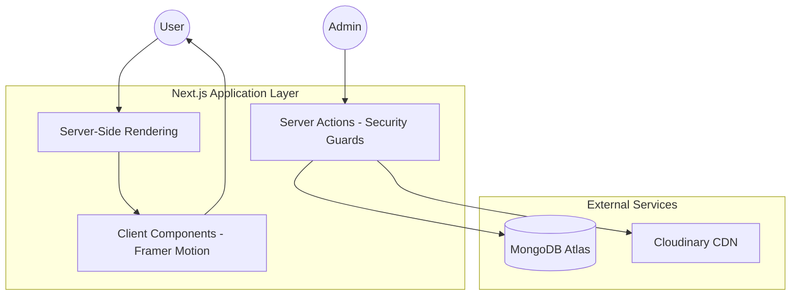

<div align="center">
  <!-- Placeholder for GIF -->
  

  <h1>✨ Anuj Siwach | Full-Stack Portfolio</h1>

  <p><strong>A premium, high-performance portfolio built with Next.js 14, TypeScript, and MongoDB.</strong></p>

  <p>
    <a href="https://anujer.is-a.dev">
      
    </a>
    <a href="https://github.com/Anuj-er/Folio-Anuj">
      
    </a>
    
  </p>
</div>

---

## 🚀 Overview

This isn't just a static site. It's a full-stack application featuring a custom **Admin Dashboard**, **Server-Side Rendering (SSR)** for SEO and performance, and a robust **Security Layer** to protect data. 

Built with a focus on "Rich Aesthetics," it utilizes **Framer Motion** for glassmorphic effects and fluid micro-animations.

---

## 🛠️ Tech Stack

### Frontend & Core
- **Framework**: [Next.js 14](https://nextjs.org/) (App Router)
- **Language**: [TypeScript](https://www.typescript.org/)
- **Styling**: [Tailwind CSS](https://tailwindcss.com/)
- **Animations**: [Framer Motion](https://www.framer.com/motion/) & [React-Lenis](https://github.com/darkroomengineering/lenis)

### Backend & Infrastructure
- **Database**: [MongoDB Atlas](https://www.mongodb.com/atlas) (Mongoose ODM)
- **Asset Hosting**: [Cloudinary CDN](https://cloudinary.com/) (Secure image management)
- **Authentication**: Custom Secure Admin Portal with session-based guards.

---

## 🏗️ Architecture


```mermaid
graph TD
    User((User))
    Admin((Admin))
    
    subgraph "Next.js Application Layer"
        SSR[Server-Side Rendering]
        SC[Client Components - Framer Motion]
        SA[Server Actions - Security Guards]
    end
    
    subgraph "External Services"
        DB[(MongoDB Atlas)]
        CDN[Cloudinary CDN]
    end

    User --> SSR
    SSR --> SC
    Admin --> SA
    SA --> DB
    SA --> CDN
    SC --> User
```

---

## ✨ Key Features

- **⚡ SSR Optimized**: Data is fetched on the server to ensure zero layout shift and lightning-fast initial loads.
- **🛡️ Admin Dashboard**: A private panel to manage Projects, Experience, and Profile data without touching the code.
- **🖼️ Automated Image Optimization**: Integrated with Cloudinary for on-the-fly resizing and modern format delivery.
- **📱 Responsive & Fluid**: Custom cursors that adapt to touch devices and a smooth scrolling experience.
- **🎨 Funny 404**: A custom-designed error page with a glitch aesthetic and humorous copy.
- **⚔️ Developer Connectivity**: Integrated GitHub & LeetCode tracking for real-time coding stats.

---

## 🛡️ Security
This project implements several security best practices:
- **HTTP-Only Cookies**: Admin sessions are stored in secure, server-side cookies protecting against XSS.
- **Server Action Guards**: Every database modification action is protected by a server-side authorization check.
- **Production Seed Guard**: The data seeding script is hard-locked to prevent accidental database wipes in production.
- **Environment Sanitation**: No secrets are stored in the codebase; all keys are managed via environment variables.

---

## 📂 Folder Structure

```text
.
├── app/                  # Next.js App Router (Main & Admin)
├── components/           # UI Components (Framer Motion powered)
├── lib/                  # Database & Server Action logic
├── models/               # Mongoose Schemas
├── public/               # Static assets & Resume
├── scripts/              # Seed & Utility scripts
├── next.config.mjs       # Image Domain & Experimental settings
└── package.json          # Dependencies & Scripts
```

---

## ⚙️ Setup & Installation

### 1. Clone & Install
```bash
git clone https://github.com/Anuj-er/Folio-Anuj.git
cd Folio-Anuj
npm install
```

### 2. Environment Setup
Create a `.env.local` file (use `.env.example` as a template):
```env
MONGODB_URI=your_mongodb_uri
ADMIN_PASSWORD=your_secure_password
NEXT_PUBLIC_CLOUDINARY_CLOUD_NAME=your_cloud_name
CLOUDINARY_API_KEY=your_api_key
CLOUDINARY_API_SECRET=your_api_secret
```

### 3. Run Locally
```bash
npm run dev
```

---

## 🤝 Contributing
Contributions are welcome! If you have suggestions for improvement, feel free to open a PR.

1. Fork the Project
2. Create your Feature Branch (`git checkout -b feature/AmazingFeature`)
3. Commit your Changes (`git commit -m 'Add some AmazingFeature'`)
4. Push to the Branch (`git push origin feature/AmazingFeature`)
5. Open a Pull Request

---

<div align="center">
  <p>If you like this project, please give it a ⭐️!</p>
  <p>Created with ❤️ by <a href="https://github.com/Anuj-er">Anuj Kumar</a></p>
</div>
