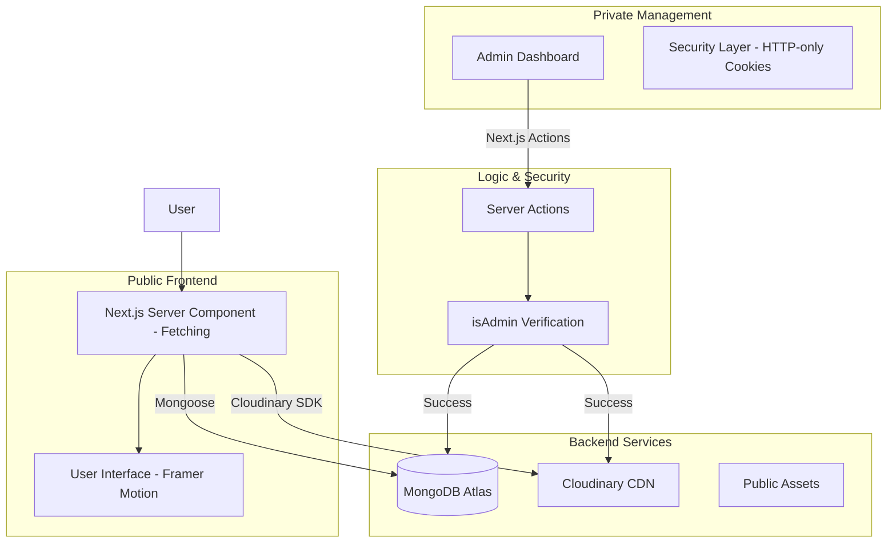
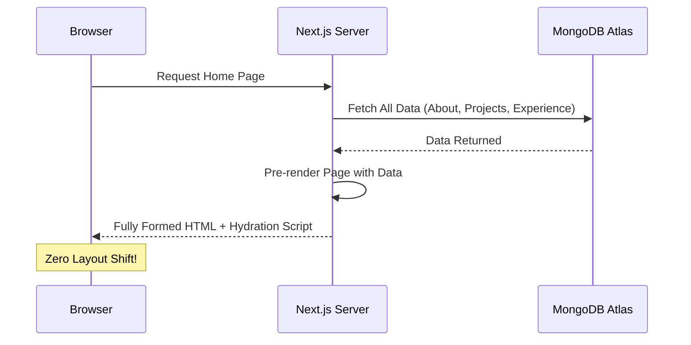

<div align="center">
  

  <h1>Anuj Siwach</h1>

  <p align="center">
    <kbd>Next.js 14</kbd> • <kbd>TypeScript</kbd> • <kbd>MongoDB Atlas</kbd> • <kbd>Cloudinary</kbd> • <kbd>Framer Motion</kbd>
  </p>

  <p align="center">
    <a href="https://anujer.is-a.dev">
      
    </a>
    <a href="https://github.com/Anuj-er/Folio-Anuj">
      
    </a>
    
    
  </p>

  <br />

  <p align="center">
    <strong>A production-grade, high-performance portfolio engineered for aesthetics and security.</strong><br />
    Featuring Server-Side Rendering (SSR), Secure Admin Controls, and complex fluid animations.
  </p>
</div>

---

## � Deep Dive: The Project Architecture

This project is built using a **hybrid architecture** that balances the SEO benefits of Server-Side Rendering with the interactivity of modern React Client Components.

### 🏗️ System Overview


```mermaid
graph TD
    subgraph "Public Frontend"
        UI[User Interface - Framer Motion]
        SSR[Next.js Server Component - Fetching]
    end

    subgraph "Private Management"
        Admin[Admin Dashboard]
        Auth[Security Layer - HTTP-only Cookies]
    end

    subgraph "Backend Services"
        DB[(MongoDB Atlas)]
        CDN[Cloudinary CDN]
        Storage[Public Assets]
    end

    subgraph "Logic & Security"
        Actions[Server Actions]
        Guards[isAdmin Verification]
    end

    User --> SSR
    SSR --> UI
    SSR -- "Mongoose" --> DB
    SSR -- "Cloudinary SDK" --> CDN
    
    Admin -- "Next.js Actions" --> Actions
    Actions --> Guards
    Guards -- "Success" --> DB
    Guards -- "Success" --> CDN
```

---

## 🛡️ Security Hardening (Production Ready)

Unlike basic portfolios, this project treats security as a first-class citizen. 

<details>
<summary><b>Click to view detailed Security Protocols</b></summary>
<br />

| Feature | Implementation | Purpose |
| :--- | :--- | :--- |
| **Server-Side Authorization** | `isAdmin()` Guard | Prevents unauthorized triggering of database actions (Create/Update/Delete). |
| **Session Protection** | HTTP-Only Cookies | Stores auth tokens in non-accessible cookies to prevent XSS attacks. |
| **Action Guards** | Persistent Validation | All data mutations are checked server-side before execution. |
| **Production Locks** | Seed Guard | The `seed.js` script refuses to wipe the database if `NODE_ENV=production`. |
| **Secret Management** | Environment Variables | No keys (Cloudinary, MongoDB, Passwords) are ever leaked in the repo. |

</details>

---

## ⚡ Performance Optimization

### The SSR Data Flow
The application has been refactored from Client-Side `useEffect` fetching to **Server-Side Rendering**.


```mermaid
sequenceDiagram
    participant Browser
    participant Server as Next.js Server
    participant DB as MongoDB Atlas

    Browser->>Server: Request Home Page
    Server->>DB: Fetch All Data (About, Projects, Experience)
    DB-->>Server: Data Returned
    Server->>Server: Pre-render Page with Data
    Server-->>Browser: Fully Formed HTML + Hydration Script
    Note over Browser: Zero Layout Shift!
```

---

## ✨ Features Spotlight

<div align="center">
  <table width="100%">
    <tr>
      <td width="50%" align="center">
        <h3>🛡️ Admin Dashboard</h3>
        <p>A secure, private portal to edit your bio, add new projects, and update work experience without writing a single line of code.</p>
      </td>
      <td width="50%" align="center">
        <h3>🎨 Rich Aesthetics</h3>
        <p>Leveraging GSAP and Framer Motion to create smooth glassmorphic effects, particle backgrounds, and fluid scroll-linked animations.</p>
      </td>
    </tr>
    <tr>
      <td width="50%" align="center">
        <h3>🖼️ Image Performance</h3>
        <p>Uses <code>next/image</code> with Cloudinary CDN. Features modern formats (WebP/AVIF) and optimized <code>sizes</code> for 100% Core Web Vital scores.</p>
      </td>
      <td width="50%" align="center">
        <h3>⚔️ Developer Connectivity</h3>
        <p>Integrated GitHub & LeetCode tracking. Displays real-time coding activity and performance directly on the profile.</p>
      </td>
    </tr>
  </table>
</div>

---

## 📂 Project Navigation

```text
.
├── app/
│   ├── (main)/           # Public views (SSR optimized)
│   ├── admin/            # Secure management dashboard
│   ├── api/              # Cloudinary signature routes
│   └── layout.tsx        # Global design tokens
├── components/
│   ├── ui/               # Reusable Framer Motion components
│   └── admin/            # Dashboard specific controls
├── lib/
│   ├── actions.ts        # Secure Server Actions (The Brain)
│   └── db.ts             # Mongoose connection pool
├── models/               # MongoDB Schemas
└── scripts/              # Productivity & Backup tools
```

---

## ⚙️ Quick Start

### 1️⃣ Installation
```bash
git clone https://github.com/Anuj-er/Folio-Anuj.git
cd Folio-Anuj
npm install
```

### 2️⃣ Environment Configuration
Create a `.env.local` using the template below:

```env
# Database
MONGODB_URI=your_uri_here

# Admin Portal
ADMIN_PASSWORD=your_secure_pass

# Cloudinary
NEXT_PUBLIC_CLOUDINARY_CLOUD_NAME=name
CLOUDINARY_API_KEY=key
CLOUDINARY_API_SECRET=secret
```

### 3️⃣ Run Dev
```bash
npm run dev
```

---

<div align="center">
  <h3>✨ Built for impact. Secured for scale. ✨</h3>
  <p>If you like this project, please consider giving it a ⭐️!</p>
  <p>Created by <a href="https://github.com/Anuj-er">Anuj Siwach</a></p>
</div>
